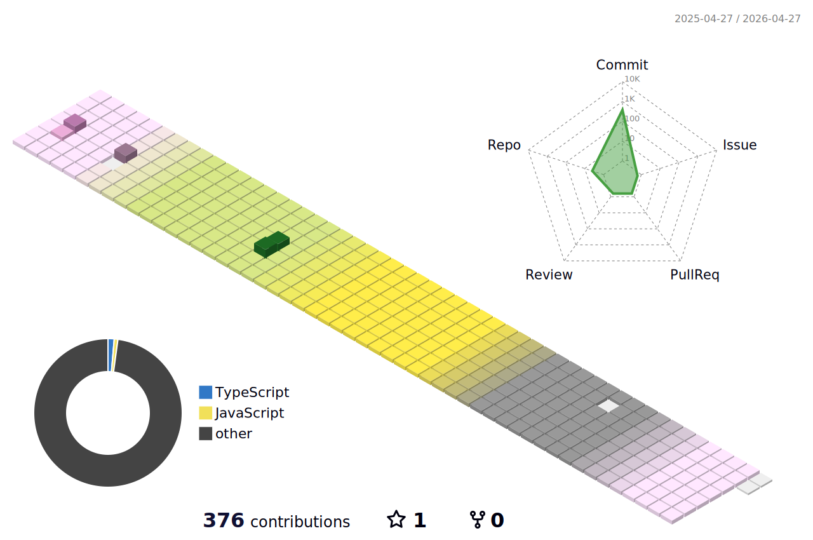

 ## 
 <h4>Name || QWAN DONG YEOUNG (권동영)</h4>
 <h4> 현 재학중인 학교및 학과 || 성일정보고등학교 소프트웨어개발과 재학중</h4>
 <h4> My schools and departments || Sungil Information High School | Department of Software Development<h4>

  

##

 

##

 
 
## 📃  Clubs and after-school classes

| 동아리 및 방과후 수업 | 활동 기간 | 활동 내용 |
|:--------:|:--------:|:--------:|
| 성일정보고등학교 프로그래머스 동아리 | 2023. 03 ~ 2023.12| 코딩테스트 대비 코딩문제 풀이  |
| 성일정보고등학교 방과후 자바 수업 | 2023. 04 ~ 2023.12 | 자바 기초 강의 및 코드 활용  |
| 성일정보고등학교 파이썬 심화 수업 | 2023. 03 ~ 2023.12 | 파이썬 기초및 심화 관련 문제 해결  |
| 성일정보고등학교 방과후 웹 개발 수업 | 2023.07 ~ 2023.12 | HTML,CSS 강의 및 활용|
| 성일정보고등학교 방과후 자바 레벨 3 수업 | 2024.04 ~ 2024.## | 자바 심화 수업 복습 및 심화 문제 풀이 |
| 성일정보고등학교 방과후 AI 수업 | 2024.04 ~ 2024.## | 앱,AI 강의 및 문제 풀이 |
| 성일정보고등하교 SSS 4기 스터디 | 2024.04 ~ 2024.## | 응용프로그램 기초, 파이썬 기초 학습 |

 

##

